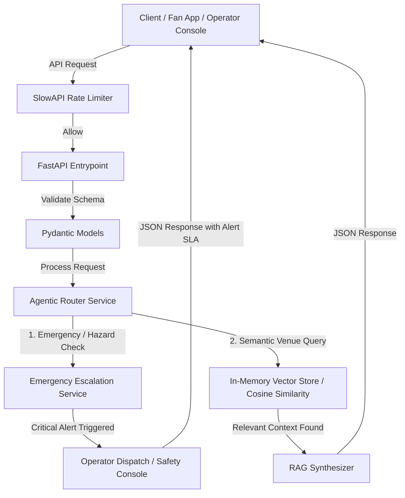

# StadiumOS: Smart Stadiums Operations & Agentic Routing Platform

### FIFA World Cup 2026™ Edition

StadiumOS is a production-ready, high-performance async FastAPI backend designed for the FIFA World Cup 2026 Smart Stadiums challenge. The platform enables stadium operators to orchestrate real-time fan engagement, micro-navigation routing, and critical safety/emergency escalation using an **Agentic Router Pattern** and a decoupled, sub-millisecond **In-Memory RAG Vector Store**.

---

## 🛠️ Architecture & Core Components

The system is architected as a layered, decoupled stream of specialized services working asynchronously to process user queries and safeguard execution:



### Core Technologies

- **FastAPI Web Framework:** Leveraging asynchronous Python event loops for concurrent, non-blocking network I/O execution.
- **Agentic Router Pattern:** Evaluates incoming user inputs dynamically. Critical severity categories (e.g., medical anomalies, active fire hazards, safety threats) bypass RAG document lookups entirely, executing deterministic circuit-breaking paths to trigger immediate emergency dispatch alerts.
- **In-Memory RAG Vector Store:** Native matrix operations performing optimized vocabulary vector scoring. Eliminates heavy external cloud network lookups or costly GPU dependencies, maintaining an ultra-lean local footprint.
- **Layered DDoS Defenses (`slowapi`):** Sliding-window rate limiters safeguarding public endpoints against brute-force traffic floods and ensuring high availability during high-throughput match day peaks.
- **Strict Pydantic Validation Matrix:** Enforces clean data entry schemas at the route entry point, capturing structural mutations before they hit downstream application layers.

---

## 🧪 Enterprise-Grade Testing & Validation Suite

StadiumOS features an elite testing suite that validates both semantic accuracy and structural resilience under real-world chaos.

### 1. Property-Based Fuzz Testing (`hypothesis`)

Located in `tests/test_fuzzing.py`, this suite implements boundary fuzzing algorithms to secure input ingestion schemas.

**Mechanism**

Rather than checking static mocks, it dynamically mutates thousands of randomized Unicode payloads, emojis, extreme string lengths, boundary sizes, and unmapped null bytes.

**Objective**

Asserts that Pydantic parsing layers catch and return structured validation responses (`422 Unprocessable Entity`) or custom rate constraints without ever dropping the server into an unhandled `500 Internal Server Error`.

---

### 2. High-Throughput Concurrency Simulation (`locust`)

Located in `tests/load_test.py`, this engine scales concurrent testing profiles to simulate multi-user behavior profiles.

**Mechanism**

Simulates realistic fan behaviors (e.g., a balanced traffic mix of **70% query routing requests**, **10% emergency escalation scenarios**, and **20% high-frequency endpoint interactions**) under structured user ramps.

**Objective**

Monitors backend throughput stability and connections under sustained request volume profiles to verify network buffer safety.

---

# 🚀 Getting Started

## 1. System Requirements

- Python 3.11+
- Active Virtual Environment (`.venv`)

---

## 2. Installation & Setup

Clone the repository, set up your workspace environment, and install the verified dependencies.

```powershell
# Install required dependencies
.venv\Scripts\pip install -r requirements.txt
```

---

## 3. Launching the High-Availability Server

Boot up the ASGI service engine bound to the local network loop.

```powershell
.venv\Scripts\uvicorn app.main:app --reload --host 127.0.0.1 --port 8000
```

Interactive API Documentation:

```
http://127.0.0.1:8000/docs
```

---

## 4. Executing the Test Framework

Run the automated test specifications, boundary fuzzers, and network validation suite.

```powershell
# Run regular test suite and fuzzing metrics
.venv\Scripts\pytest -v
```

To initialize the concurrent load simulation (ensure the Uvicorn server is already running in another terminal):

```powershell
# Run the 30-second 100-user headless load injection
.venv\Scripts\locust -f tests/load_test.py --headless -u 100 -r 10 --run-time 30s --host http://127.0.0.1:8000
```