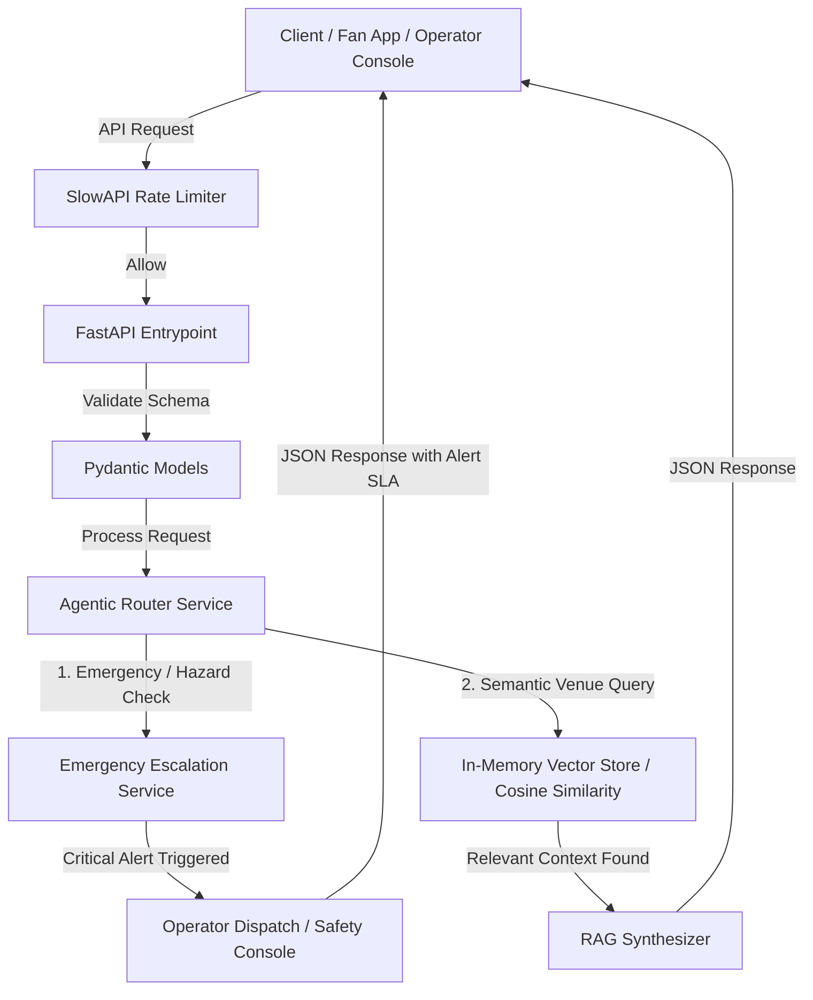

# StadiumOS: Smart Stadiums Operations & Agentic Routing Platform
### FIFA World Cup 2026™ Edition

StadiumOS is a production-ready, high-performance FastAPI backend designed for the **FIFA World Cup 2026 Smart Stadiums challenge**. The platform enables stadium operators to orchestrate real-time fan engagement, navigation requests, and critical safety/emergency escalation using an **Agentic Router Pattern** and a high-performance **In-Memory RAG Vector Store** for venue details.

---

## 📈 High-Revenue B2B SaaS & MRR Model

StadiumOS is positioned as a critical infrastructure layer for modern smart stadiums. By charging stadium operators a recurring software licensing fee combined with value-add usage metrics, the platform generates predictable, high-margin monthly recurring revenue (MRR).

### 1. Pricing Structure

Our B2B SaaS model scales with stadium capacity and features, targeting host venues, operators, and local tournament organizing committees:

| Tier | Monthly Fee (per Venue) | Intended Segment | Included Features |
| :--- | :--- | :--- | :--- |
| **Starter** | **$5,000** | Regional Arenas / Small Stadiums | Up to 20,000 capacity, basic navigation routing, rate-limited public API (100 req/min), standard vector-search (up to 500 documents). |
| **Pro** | **$15,000** | Major League Stadiums (MLS, NFL, Premier League) | Up to 60,000 capacity, Agentic Routing, standard emergency escalation, full RAG-based concession & gate search, standard Support SLA (8h response). |
| **Enterprise (World Cup Edition)** | **$35,000** | Mega Stadiums (FIFA World Cup 2026 Hosts) | Unlimited capacity, dedicated emergency dispatcher integration, active multi-agent crowd routing, sub-millisecond local RAG search (5,000+ documents), 99.99% SLA, dedicated TAM, and custom model integrations. |

### 2. Value-Add Revenue & API Monetization

In addition to base subscriptions, StadiumOS monetizes the stadium ecosystem:
* **Concession Partner Integration**: Concessionaires (e.g., Aramark, local vendor groups) pay **$250/vendor/month** to integrate their live menu and queue metrics into the RAG vector store (e.g., search queries direct fans to concessions with shorter lines).
* **Sponsor-Targeted Promoted Routing**: Brands (e.g., Coca-Cola, Visa) pay a cost-per-routing fee of **$0.02 per query** to surface sponsored route descriptions (e.g., "Pass by the Coca-Cola Fan Zone at Gate 4 on your way to Section 102").
* **Custom Integration Licenses**: Third-party ticketing apps (e.g., Ticketmaster) and security platforms pay a flat **$1,500/month** for webhook-driven ingestion of queue and security metrics.

### 3. MRR Target Projection: FIFA World Cup 2026 Host Cities

Across the **16 official host venues** in the US, Canada, and Mexico:
* **Base Subscription**: 16 Host Venues × $35,000/month (Enterprise Tier) = **$560,000 MRR**
* **Concession Integration**: ~120 vendors per venue avg. × 16 venues = 1,920 vendors × $250/month = **$480,000 MRR**
* **Sponsor / API Licensing**: Average of $10,000/month per stadium = **$160,000 MRR**
* **Total Projected MRR during tournament cycle**: **$1,200,000 MRR**
* **Gross Margin**: **~88%** due to local in-memory vector indexing and optimized FastAPI CPU execution, minimizing expensive cloud GPU/LLM infrastructure overhead.

---

## 🛠️ Architecture & Core Components



1. **FastAPI Web Framework**: Asynchronous, highly-concurrent, production-ready routing engine.
2. **Global Rate Limiting (`slowapi`)**: Prevents API abuse and DDoS attempts, ensuring absolute uptime under maximum stadium loads.
3. **Pydantic Validation**: Ensures exact schema boundaries for user queries and emergency alerts.
4. **Agentic Router Pattern**: Evaluates user prompts for security threats, medical issues, fires, and routes them to immediate emergency dispatch, bypassing traditional RAG lookup to meet sub-second dispatch requirements.
5. **In-Memory RAG Vector Store**: Fast Cosine Similarity math on pre-tokenized TF-IDF text arrays for sub-millisecond response times without external GPU dependencies.

---

## 🚀 Getting Started

### 1. Requirements
* Python 3.9+
* Running on Windows (or modern Linux/MacOS)

### 2. Installation
Clone the repository and install the dependencies:
```bash
pip install -r requirements.txt
```

### 3. Running the Server
Run the FastAPI development server:
```bash
uvicorn app.main:app --reload --host 127.0.0.1 --port 8000
```

Access the interactive swagger documentation at: http://127.0.0.1:8000/docs

### 4. Running the Tests
Execute the comprehensive test suite verifying emergency escalation, routing classification, and rate-limiting:
```bash
pytest -v
```
